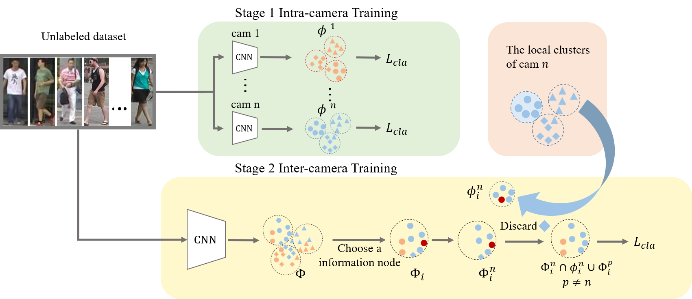
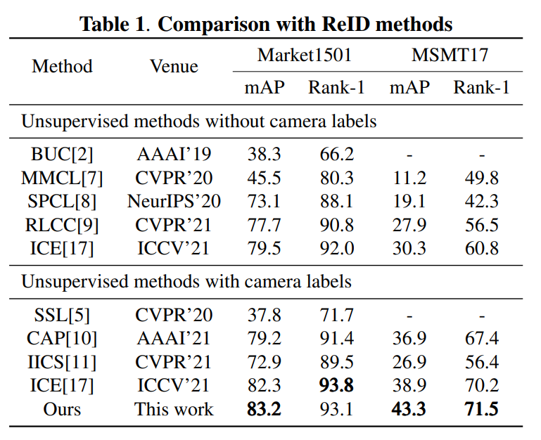

# Pseudo labels refinement with intra-camera similarity for unsupervised person re-identification!


The *official* repository for [Pseudo labels refinement with intra-camera similarity for unsupervised person re-identification](https://arxiv.org/abs/2304.12634.pdf). We achieve state-of-the-art performances on **unsupervised learning** tasks for person re-ID.

**Our unified framework**



## Requirements

### Installation

```shell
git clone git@github.com:leeBooMla/ICSR.git
cd ICSR
python setup.py develop
```

### Prepare Datasets

```shell
cd examples/data
```
Download the person datasets Market-1501,MSMT17,PersonX,DukeMTMC-reID.
Then unzip them under the directory like

```
ICSR/examples/data
├── market1501
│   └── Market-1501-v15.09.15
├── msmt17
│   └── MSMT17_V1
├── personx
│   └── PersonX
├── dukemtmcreid
│   └── DukeMTMC-reID
```

### Prepare ImageNet Pre-trained Models for IBN-Net

When training with the backbone of [IBN-ResNet](https://arxiv.org/abs/1807.09441), you need to download the ImageNet-pretrained model from this [link](https://drive.google.com/drive/folders/1thS2B8UOSBi_cJX6zRy6YYRwz_nVFI_S) and save it under the path of `examples/pretrained/`.

ImageNet-pretrained models for **ResNet-50** will be automatically downloaded in the python script.

## Training

We utilize 4 GTX-2080TI GPUs for training.

**examples:**

Market-1501:

1. Intra-camera training:
```shell
python examples/train_cam.py -b 64 -a resnet50 -d market1501 --iters 100 --num-instances 4
```


2. Inter-camera training:
```shell
python examples/train_global.py -b 64 -a resnet_ibn50a -d market1501 --iters 200 --num-instances 4
```

MSMT17:

1. Intra-camera training:
```shell
python examples/train_cam.py -b 64 -a resnet50 -d msmt17 --iters 100 --num-instances 4
```


2. Inter-camera training:
```shell
python examples/train_global.py -b 64 -a resnet_ibn50a -d msmt17 --iters 400 --num-instances 4
```


## Evaluation

We utilize 1 GTX-2080TI GPU for testing. **Note that**

+ use `--width 128 --height 256` (default) for person datasets;

+ use `-a resnet50` (default) for the backbone of ResNet-50, and `-a resnet_ibn50a` for the backbone of IBN-ResNet.

To evaluate the model, run:
```shell
CUDA_VISIBLE_DEVICES=0 \
python examples/test.py \
  -d $DATASET --resume $PATH
```

**Some examples:**
```shell
### Market-1501 ###
CUDA_VISIBLE_DEVICES=0 \
python examples/test.py \
  -d market1501 --resume logs/market1501/model_best.pth.tar
```

## Results




## Citation
